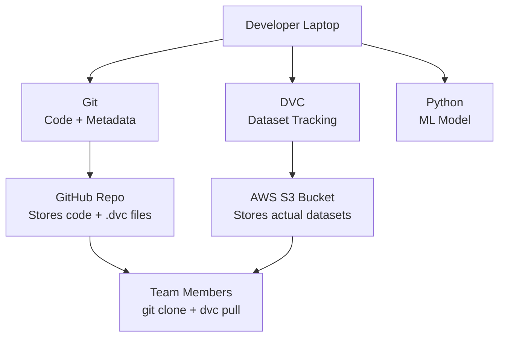

# DVC + Git + S3 Workflow

```mermaid
flowchart TD

A[Developer Laptop]

A --> B[Git<br/>Code + Metadata]
A --> C[DVC<br/>Dataset Tracking]
A --> D[Python<br/>ML Model]

B --> E[GitHub Repo<br/>Stores code + .dvc files]

C --> F[AWS S3 Bucket<br/>Stores actual datasets]

E --> G[Team Members<br/>git clone + dvc pull]
F --> G
```

## Workflow

1. Developer tracks dataset using DVC
2. Dataset stored in S3
3. Code stored in GitHub
4. Team clones repo
5. Team runs `dvc pull`
